# TP 2 DPBO — Absolute Cinema 

Tugas Praktikum 2 Mata Kuliah **Desain dan Pemrograman Berorientasi Objek (DPBO)**.

Program ini menampilkan data film bioskop dengan format premium dalam empat edisi bahasa: C++, Java, Python, dan PHP. Seluruh edisi menggunakan konsep pewarisan class yang sama, tetapi memiliki antarmuka dan mekanisme penyimpanan yang berbeda.

## Janji

Saya Nabila Attaya Putri Cahyadi dengan NIM 2508355 mengerjakan Tugas Praktikum 1 pada Mata Kuliah Desain dan Pemrograman Berorientasi Objek (DPBO) untuk keberkahan-Nya maka saya tidak melakukan kecurangan seperti yang telah dispesifikasikan. Aamiin

## Ringkasan Proyek

| Edisi | Antarmuka | Penyimpanan data |
|---|---|---|
| C++ | Terminal/CLI | `vector` dinamis selama program berjalan |
| Java | Terminal/CLI | `ArrayList` selama program berjalan |
| Python | Terminal/CLI | List selama program berjalan |
| PHP | Halaman web | `$_SESSION` pada sesi pengguna |

Fitur utama program:

- Menggunakan multi-level inheritance melalui `Film`, `CinemaFilm`, dan `PremiumFormatCinemaFilm`.
- Menyediakan data awal lima film bioskop format premium.
- Menambahkan film baru melalui perintah `/add` pada C++, Java, dan Python.
- Menampilkan seluruh film melalui perintah `/display` pada C++, Java, dan Python.
- Menghentikan program melalui perintah `/exit` pada C++, Java, dan Python.
- Menyediakan form web, validasi, unggah poster, dan sesi pada PHP.
- Menampilkan pesan kesalahan dan mengulang input sampai nilai valid pada edisi terminal.
- Menampilkan pesan kesalahan per field dan mempertahankan nilai form pada PHP.

Perintah yang tersedia pada C++, Java, dan Python:

| Perintah | Fungsi |
|---|---|
| `/add` | Menambahkan film format premium baru |
| `/display` | Menampilkan seluruh film dalam bentuk tabel |
| `/exit` | Menampilkan pesan perpisahan dan menghentikan program |

## Struktur Folder
```text
TP2DPBO2526C1/
│
├── README.md
├── design_diagram.png
│
├── cpp/
│   ├── Film.cpp
│   ├── CinemaFilm.cpp
│   ├── PremiumFormatCinemaFilm.cpp
│   ├── main.cpp
│   └── input.txt
│
├── java/
│   ├── Film.java
│   ├── CinemaFilm.java
│   ├── PremiumFormatCinemaFilm.java
│   ├── Main.java
│   └── input.txt
│
├── python/
│   ├── Film.py
│   ├── CinemaFilm.py
│   ├── PremiumFormatCinemaFilm.py
│   ├── main.py
│   └── input.txt
│
├── php/
│   ├── Film.php
│   ├── CinemaFilm.php
│   ├── PremiumFormatCinemaFilm.php
│   ├── index.php
│   └── images/
│       ├── absolute_cinema.png
│       ├── hotb.png
│       ├── pm2.png
│       ├── re.png
│       ├── smbnd.png
│       └── to.png
│
└── dokumentasi/
    ├── cpp1.png
    ├── cpp2.png
    ├── java1.png
    ├── java2.png
    ├── python1.png
    ├── python2.png
    ├── php1.png
    ├── php2.png
    ├── php3.png
    └── php4.png
```

## Diagram Desain

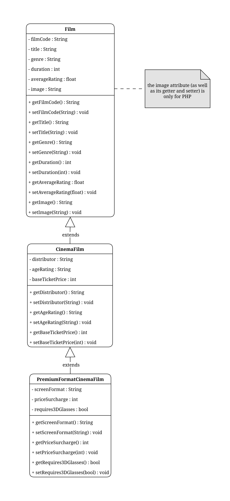

### Hierarki Class

```text
Film
└── CinemaFilm
    └── PremiumFormatCinemaFilm
```

Ketiga class menggunakan inheritance untuk memenuhi kebutuhan data pada tingkat kekhususan yang berbeda:

1. **`Film`** menyimpan informasi dasar yang berlaku untuk semua jenis film, yaitu kode, judul, genre, durasi, dan rating rata-rata.
2. **`CinemaFilm`** mewarisi seluruh atribut `Film`, kemudian menambahkan data khusus film bioskop: distributor, klasifikasi usia, dan harga tiket dasar.
3. **`PremiumFormatCinemaFilm`** mewarisi data `Film` dan `CinemaFilm`, kemudian menambahkan data khusus layanan premium: format layar, tambahan harga, dan kebutuhan kacamata 3D.

Objek yang digunakan oleh seluruh program adalah `PremiumFormatCinemaFilm`. Karena pewarisan, objek tersebut dapat mengakses seluruh atribut dan method yang berasal dari kedua class induknya.

### Prinsip OOP

- **Inheritance:** `CinemaFilm` adalah `Film`, sedangkan `PremiumFormatCinemaFilm` adalah `CinemaFilm` sekaligus `Film`.
- **Encapsulation:** data disimpan sebagai atribut dan diakses melalui getter/setter. C++, Java, dan PHP menggunakan atribut `private`; Python menggunakan atribut instance dengan konvensi accessor.
- **Reuse:** method dasar film tidak diduplikasi pada class yang lebih spesifik.
- **Constructor initialization:** constructor menerima data awal dan menginisialisasi atribut secara berurutan dari class induk ke class anak.
- **Specialization:** atribut dan method ditambahkan hanya pada class yang memang membutuhkan informasi tersebut.

## Method Program

### C++, Java, dan Python

Implementasi C++ menggunakan function, Java menggunakan private static method, sedangkan Python menggunakan function di `main.py`.

| Method/function | Fungsi |
|---|---|
| `main` / `Main.main` / `main()` | Titik masuk yang menyiapkan data awal, menampilkan menu, dan menjalankan loop perintah. |
| `addFilm(filmList, genres)` | Membaca data film baru, memvalidasi input, membuat objek, lalu menambahkannya ke list. |
| `displayFilms(filmList)` | Memeriksa list, mengubah setiap objek menjadi baris tabel, lalu menampilkan tabel dan jumlah film. |
| `calculateColumnWidths(rows)` | Menghitung lebar kolom berdasarkan nilai terpanjang pada setiap kolom. |
| `printTableBorder(columnWidths)` | Meng mencetak garis batas tabel. |
| `printTableHeader(columnWidths)` | Meng mencetak baris judul kolom. |
| `printTableRow(row, columnWidths)` | Meng mencetak satu baris film dengan lebar kolom yang sudah dihitung. |
| `trimTrailingWhitespace(value)` | Hanya terdapat pada Java; menghapus spasi di akhir input numerik sebelum validasi. |

Method pembentuk tabel dipisahkan dari `displayFilms` agar logika pembentukan data, perhitungan lebar, dan pencetakan dapat digunakan secara terpisah.

### PHP

| Function | Fungsi |
|---|---|
| `escapeHtml($value)` | Mengubah teks menjadi HTML entity agar aman ditampilkan dari input pengguna. |
| `getFilmByCode($filmList, $filmCode)` | Mencari objek film berdasarkan kode dan mengembalikan objek atau `null`. |
| `validateFilmData($data, $genres, $filmList)` | Memvalidasi seluruh field serta mengembalikan array pesan kesalahan. |
| `saveUploadedImage($file, &$errors, $currentImage)` | Memeriksa file yang diunggah, membuat nama unik, menyimpan gambar, dan mengembalikan path-nya. |
| Blok POST `action=add` | Menerima form, menyimpan gambar, membuat objek premium, dan menambahkannya ke sesi. |
| Bagian render HTML | Menampilkan form, pesan sukses/error, dan tabel film dari sesi. |

## Alur Program Terminal

Alur berikut berlaku untuk C++, Java, dan Python.
1. Program membuat daftar genre yang dapat dipilih.
2. Program membuat lima objek `PremiumFormatCinemaFilm` sebagai data awal.
3. Layar sambutan, menu, dan loop input ditampilkan.
4. Pada `/add`, program membaca data secara berurutan. Input yang tidak valid menyebabkan program mengulang pertanyaan hingga data valid.
5. Setelah semua data valid, constructor `PremiumFormatCinemaFilm` dipanggil dan objek baru ditambahkan ke daftar film.
6. Pada `/display`, setiap objek dibaca melalui getter, dikonversi menjadi baris teks, lalu ditampilkan sebagai tabel.
7. Pada `/exit`, program menampilkan pesan perpisahan lalu berhenti.
8. Perintah yang tidak dikenal menghasilkan pesan `invalid command` dan program kembali ke menu.

Data film pada ketiga edisi terminal hanya tersimpan selama program berjalan. Program tidak menyediakan fitur hapus, sehingga data awal dan data yang ditambahkan akan tetap tampil sampai program dihentikan.

## Alur Program PHP
1. `index.php` memuat `PremiumFormatCinemaFilm`; pernyataan `require` pada class anak secara berurutan juga memuat `CinemaFilm` dan `Film`.
2. Sesi dengan nama `absolute_cinema_session` dimulai.
3. Jika sesi belum memiliki daftar objek yang valid, lima film contoh dibuat.
4. Ketika formulir dikirim, server membersihkan input, memeriksa format data, dan mencari kode film yang duplikat.
5. Berkas gambar diperiksa berdasarkan tipe MIME JPG atau PNG, lalu disimpan dengan nama unik.
6. Jika tidak ada error, objek baru dibuat dan dimasukkan ke daftar film dalam sesi.
7. Jika terjadi error, nilai formulir dipertahankan agar pengguna dapat memperbaiki input.
8. Halaman utama menampilkan formulir dan tabel film. Tautan `?absoluteCinema=1` menampilkan layar Absolute Cinema.


## Error Handling

| Bagian | Kondisi tidak valid | Penanganan |
|---|---|---|
| Command Terminal | Command bukan `/add`, `/display`, atau `/exit` | Menampilkan `invalid command`, lalu kembali meminta command. |
| `filmCode` | Tidak mengikuti format `PCF000` | Menampilkan;format yang benar dan meminta ulang. |
| `filmCode` | Kode sudah digunakan | Menampilkan kode duplikat dan meminta kode lain. |
| `title` | Kosong pada PHP | Menampilkan `title is required`. |
| `genre` | Tidak terdapat dalam daftar genre | Menampilkan daftar genre yang valid dan meminta ulang. |
| `duration` | Bukan bilangan bulat, negatif, atau lebih dari 873 | Menampilkan kesalahan dan meminta nilai dalam rentang `0–873`. |
| `baseTicketPrice` | Bukan bilangan bulat, negatif, atau lebih dari 500 | Menampilkan kesalahan dan meminta nilai dalam rentang `0–500`. |
| `averageRating` | Bukan bilangan, negatif, atau lebih dari 10 | Menampilkan kesalahan dan meminta nilai dalam rentang `0–10`. |
| `priceSurcharge` | Bukan bilangan bulat atau negatif | Menampilkan kesalahan dan meminta bilangan bulat nonnegatif. |
| `requires3DGlasses` | Nilai selain `true` dan `false` | Menampilkan kesalahan dan meminta ulang. |
| `image` pada PHP | Tidak ada file saat menambah film baru | Menampilkan `an image is required`. |
| `image` pada PHP | Tipe MIME bukan JPG/JPEG atau PNG | Menampilkan kesalahan dan mempertahankan path gambar sebelumnya bila ada. |

Pada edisi terminal, validasi terus dilakukan di dalam loop sampai semua data valid. Pada PHP, `validateFilmData` mengumpulkan beberapa error sekaligus, sedangkan atribut `min` dan `max` pada input number memberikan validasi tambahan dari browser.

Field `distributor`, `ageRating`, dan `screenFormat` saat ini belum memiliki aturan validasi tambahan. Pada PHP, `distributor`, `ageRating`, dan `screenFormat` juga tidak ditandai wajib oleh form.

## Dokumentasi

### C++

| Tampilan awal dan tabel film | Penambahan film berhasil |
|---|---|
| 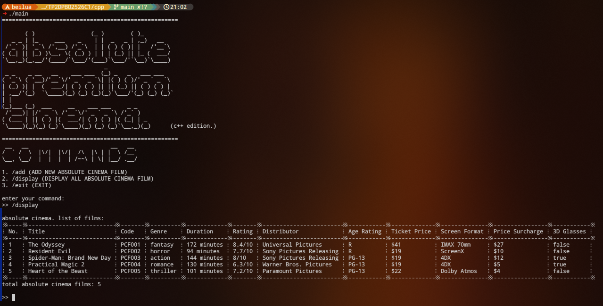 | 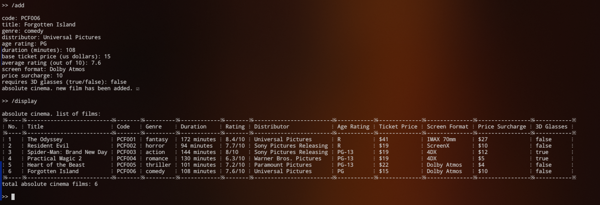 |

### Java

| Tampilan awal dan tabel film | Validasi kode dan penambahan film berhasil |
|---|---|
| 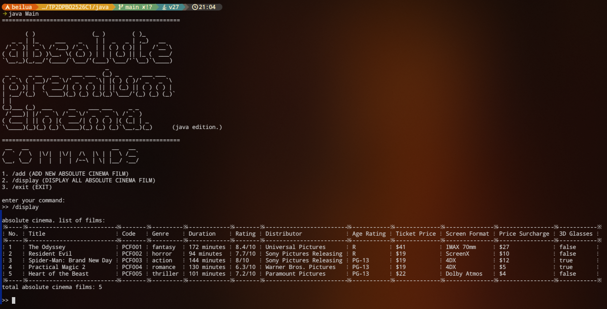 | 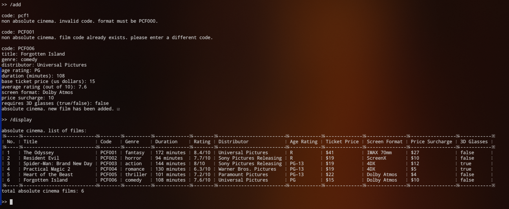 |

### Python

| Tampilan awal dan tabel film | Validasi genre dan penambahan film berhasil |
|---|---|
| 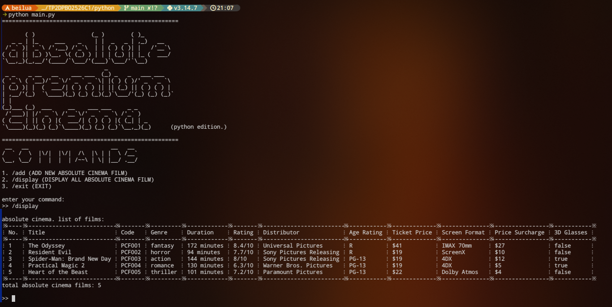 | 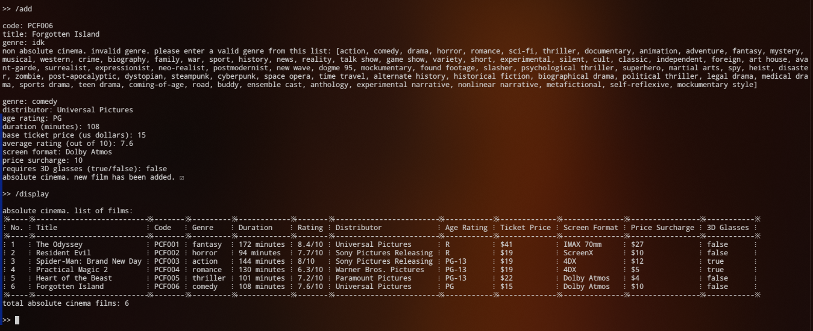 |

### PHP

| Form dan daftar film | Validasi input | Penambahan film berhasil |
|---|---|---|
| 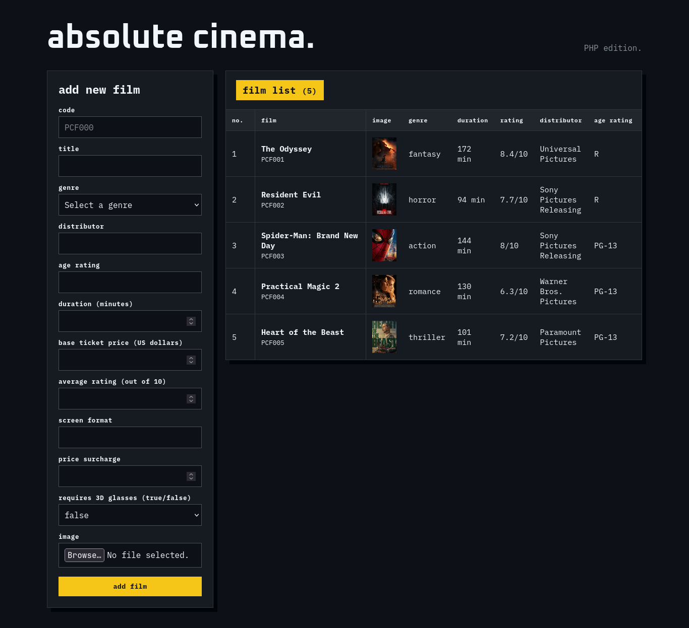 | 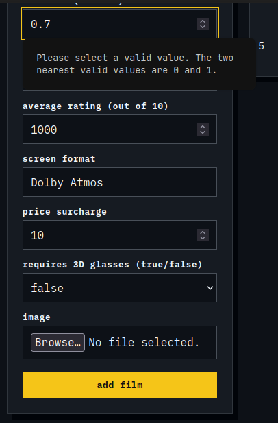<br>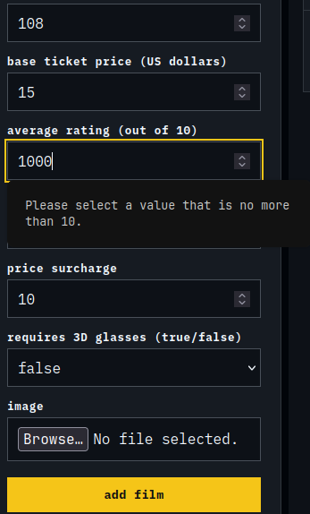 | 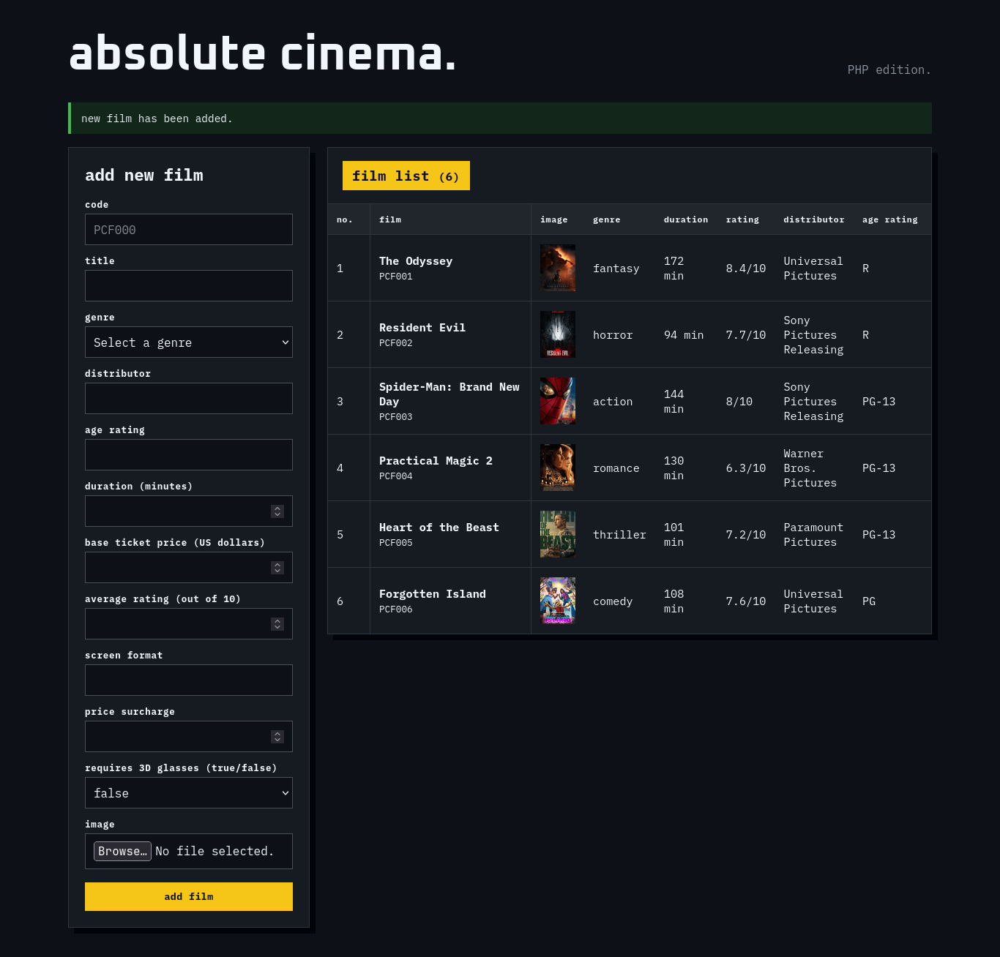 |
